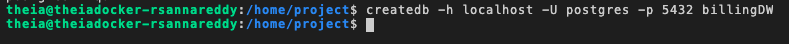
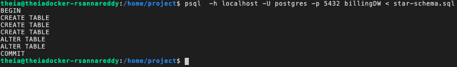

# Setting up a Staging Area

# Exercise 1: Create databases
1
export PGPASSWORD=<your_password>;
Copied!Executed!
Then run the below command which will create a database named billingDW.

1
createdb -h postgres -U postgres -p 5432 billingDW
Copied!Executed!
In the above command

-h mentions that the database server is accessible using the hostname “postgres”
-U mentions that we are using the user name postgres to log into the database
-p mentions that the database server is running on port number 5432
You should see an output like this.

# Exercise 2: Create data warehouse schema
Step 1: Download the schema files.

The commands to create the schema are available in the file below.

url = https://cf-courses-data.s3.us.cloud-object-storage.appdomain.cloud/IBM-DB0260EN-SkillsNetwork/labs/Setting%20up%20a%20staging%20area/billing-datawarehouse.tgz
Run the commands below to download and extract the schema files.

wget url
tar -xvzf billing-datawarehouse.tgz
ls *.sql

Step 2: Create the schema
psql  -h postgres -U postgres -p 5432 billingDW < star-schema.sql

# Exercise 3: Load data into Dimension tables
Step 1: Load data into DimensionCustomer tables
psql  -h postgres -U postgres -p 5432 billingDW < DimCustomer.sql

Step 2: Load data to DinMonth tables
psql -h postgres -u postgres -p 5432 billingDW < DimMonth.sql

Step 3: Load data to fact tables
psql -h postgres -u postgres - p 5432 billingDW < factBilling.sql

Step 4: Load data to verify 
psql -h postgres -u postgres - p 5432 billingDW < factBilling.sql

